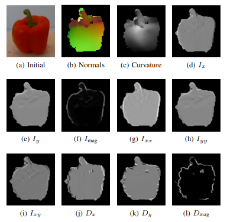

## RGB-D Covariance Descriptors

### Overview

The ability of a machine to recognize objects is a fundamental problem within
robotics and computer vision. To address this issue, we compute covariance
descriptors that encapsulate features (e.g., position, color, normals, etc.)
over an entire point cloud of an object. This results in a symmetric positive
definite matrix that embodies the characteristic features of that object.
Covariance descriptors can then be utilized to create dictionaries that provide
a compact representation of the object. Lastly, a set of dictionaries for a
range of objects can be used to classify new point cloud data.

<p align="center">

</p>

This repository provides software to enable dictionary learning on RGB-D
covariance descriptors for 3D point cloud data. The descriptors can be used
with the following features: position (x,y,z), color (r,g,b), normals (nx, ny,
nz), image intensity (I), gradient of the intensity along x and y (Ix,Iy),
magnitude of the intensity gradient (M), gradient of the depth along x and y
(Dx,Dy), magnitude of the depth gradient (D), principal curvatures (c1,c2), and
Gaussian curvature (K). The software provides the ability to create covariance
matrices given point cloud data (PCD) files as input. Descriptor data is saved
to a text file and can be used to evaluate classification performance on a
dataset via different validation methods. 

### Citation

If you find this project useful, then please consider citing our work.

```                                                                                                                                                           
@inproceedings{beksi2015object,
  title={Object Classification using Dictionary Learning and RGB-D Covariance Descriptors},
  author={Beksi, William J and Papanikolopoulos, Nikolaos},
  booktitle={Proceedings of the IEEE International Conference on Robotics and Automation (ICRA)},
  pages={1880--1885},
  year={2015}
}
```   

### Running MATLAB

To start a MATLAB session, invoke the run\_matlab.sh script which adds the 
necessary paths and environment variables to the current session. You may have 
to customize this script for your environment.

### Creating Training and Test Datasets

The training and test sets are derived from the University of Washington's
[RGB-D Object
Dataset](https://www.cs.washington.edu/research/rgb-d-object-dataset). Note
that cropped RGB and depth images are located in one dataset while the
segmented object 3D point clouds are located in another dataset. The dataset
containing the 3D point clouds is mandatory. The cropped RGB and depth images
are optional, but recommended since these features can be used to increase the
performance of the descriptor.

A subsample of the point cloud dataset can be created using the Python
utilities/generate\_subsample script. For example, to sample every fifth PCD
file from an input directory and write it to an output directory run:

    $ python utilities/generate_subsample.py rgbd-dataset subsampled-rgbd-dataset 5

In the above command, 'rgbd-dataset' is the directory containing the complete 
downloaded point cloud dataset, 'subsampled-rgbd-dataset' is the target 
directory, and '5' is the sampling rate. 

To include both the cropped RGB and depth images in the subsampled dataset
execute the following command:

    $ python utilities/copy_images.py rgbd-dataset subsampled-rgbd-dataset

In the above command, 'rgbd-dataset' is the directory containing the cropped
RGB and depth images, and 'subsampled-rgbd-dataset' is the subsampled directory
that was created using the previous command. 

The subsampled RGB-D dataset can be further split into training and test 
datasets for performing alternating contiguous frames instance 
classification:

    $ python utilities/divide_subsamples.py subsampled-rgbd-dataset subsampled-rgbd-dataset-tmp  

Followed by:

    $ python utilities/generate_acf_dataset.py subsampled-rgbd-dataset-tmp subsampled-rgbd-acf-train subsampled-rgbd-acf-test

The training and test datasets for performing leave-sequence-out instance
classification can be created simply by moving the subdirectories in the
subsampled RGB-D dataset that correspond to '2\_\*' (sensor mounted 45 degrees)
within a class to a separate test directory. The remaining subdirectories of
each class, '1\_\*' and '4\_\*', makeup the training dataset.

Now we can create a file where each line contains the absolute path to a
directory containing the point cloud, RGB, and depth data files of a class. For
example:

    /home/beksi/rgbddb/subsampled-rgbd-dataset/apple/apple_1
    /home/beksi/rgbddb/subsampled-rgbd-dataset/apple/apple_2
    /home/beksi/rgbddb/subsampled-rgbd-dataset/apple/apple_3
    ...

This allows classes to be easily added or removed simply by editing the file.
The utilities/generate\_paths.py script can facilitate the file path creation.
Next, start a MATLAB session to create the covariance descriptor data for each
class:

    > writeCovariances('categories.txt')

This will store all the covariance matrices for each class in a file (e.g.,
'class.cov') in the current directory. Next, all the covariance files can be
moved into a structured dataset using the utilities/move\_covariances script:

    $ python utlities/move_covariances.py datasets/subsampled-rgbd-dataset-covariances

To perform category classification, the following command will merge
covariances excluding categories listed in the trial file: 

    $ python utilities/generate_category_dataset.py datasets/subsampled-rgbd-dataset-covariances datasets/subsampled-cat-1 utilities/trials/trial_1.txt

### How to Perform Object Classification 

We have implemented the following methods for performing classification tests on 
the RGB-D Object Dataset: k-fold cross-validation, category classification, 
instance (alternating contiguous frames and leave-sequence-out) classification. 

Within MATLAB, instance classification can be invoked as follows:

    > instanceClassification('subsampled_lso_train.txt', 'subsampled_lso_test.txt', 64)

The first two arguments are files containing the absolute paths (one per line) to
the training and test covariance files. For instance, 

    /home/beksi/datasets/lso/subsampled-rgbd-dataset-lso-train/pcn/apple/apple_1.cov
    ...

The third argument is the number of atoms per class in the dictionary. The
script will compute the mean training error based on all class instances
followed by the mean test error using a majority vote aggregation scheme. Note
that the number of features (num\_features) parameter must be set within the
MATLAB script. For example, we would set 'num\_features=9' using the above
dataset with position, color, and normals as features. 

Similarly, category classification can be performed by running the function
categoryClassification('train\_paths', 'test\_paths', num\_atoms) within
MATLAB. The categoryCrossClassification.m script allows for category
classification based on the majority vote of two dictionaries using different
features (e.g., shape and vision based dictionaries). 

### Notes

In matpcl, there's a bug in the splitting of the RGB values. The shift needs to
be to the right, i.e.,

    $ diff loadpcd.m.orig loadpcd.m
    231,232c231,232
    <                 R = double(bitand(255, bitshift(rgb, 16))) /255;
    <                 G = double(bitand(255, bitshift(rgb, 8))) /255;
    ---
    >                 R = double(bitand(255, bitshift(rgb, -16))) /255;
    >                 G = double(bitand(255, bitshift(rgb, -8))) /255;
    237,239c237,239
    <                 R = double(bitand(255, bitshift(rgb, 24))) /255;
    <                 G = double(bitand(255, bitshift(rgb, 16))) /255;
    <                 B = double(bitand(255, bitshift(rgb, 8))) /255;
    ---
    >                 R = double(bitand(255, bitshift(rgb, -24))) /255;
    >                 G = double(bitand(255, bitshift(rgb, -16))) /255;
    >                 B = double(bitand(255, bitshift(rgb, -8))) /255;

### License

[](https://github.com/robotic-vision-lab/RGBD-Covariance-Descriptors/blob/master/LICENSE)
